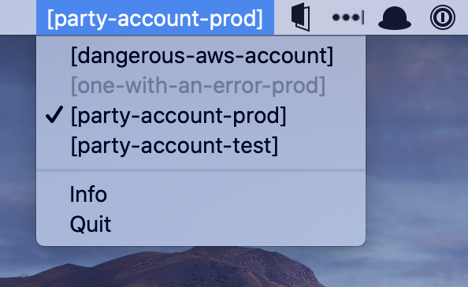

# AWS Profile Selector

This app puts the currently selected AWS profile in your notification area and enables to update the default one.

```
:warning: The app will update your ./aws/credentials file! It will update the _default_ profile. The app was only tested on MacOS.
```

## Features

- List the available profile names from your credential file
- Update the currently set default credential with a different one



## Development

The application is built with [systray](https://github.com/getlantern/systray).
